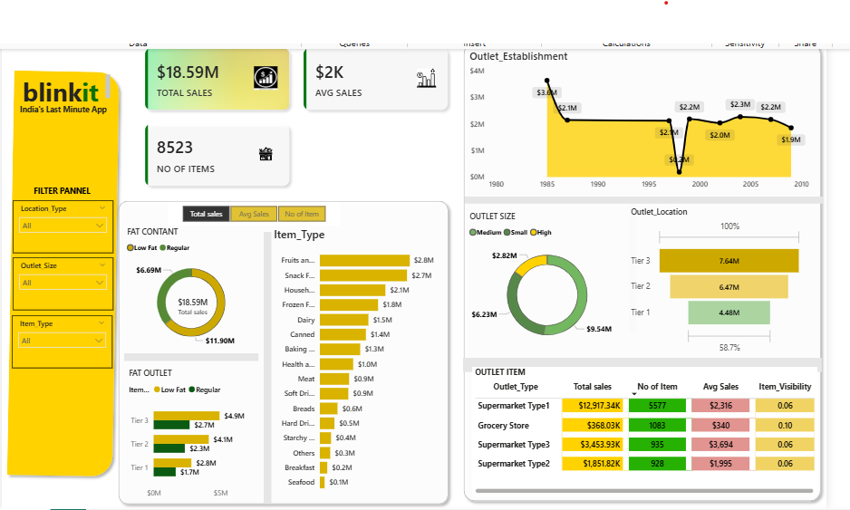

# 🛒 Blinkit Power BI Dashboard

Welcome to the Blinkit Power BI dashboard repository!  
This dashboard provides comprehensive insights into Blinkit’s business performance, including:

- Total Sales and Average Sales
- Number of Items Sold
- Outlet Performance and Store Types
- Product Categories and Sales Distribution
- Analysis by Store Size and Location

---

## 📸 Dashboard Preview

---

## 🔽 Download the Dashboard File

You can download the Power BI dashboard file here:

👉 **[Download Blinket Dashboard.pbix] https://github.com/khatiekta/Blinket-dashboard.git**
> ⚠️ Note: GitHub does not support previewing `.pbix` files directly.  
> Please click the download link and select “View Raw” to save the file to your computer.

---

## 📂 File Details

- **File Name:** blinket dashboard.pbix  
- **Created With:** Microsoft Power BI  
- **File Type:** Power BI Desktop Dashboard File  
- **Size:** Large (Preview not supported on GitHub)

---

## 🚀 How to Use

1. Download the `.pbix` file above.  
2. Open it in Microsoft Power BI Desktop.  
3. Explore various reports and visuals for detailed analysis.  

---

## 🤝 Feedback & Contributions

Feel free to open issues or submit pull requests to improve this dashboard.

---

Thanks for visiting! 😊
